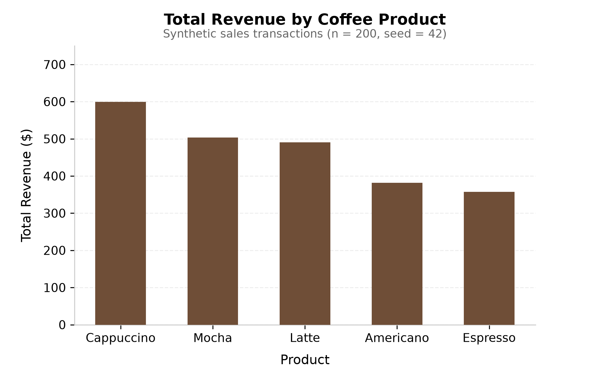

> **AI Assistance Declaration**: I used ChatGPT on 19 September 2026 to suggest the section layout of this R Markdown file. Prompts used: see the AI Assistance Disclosure in `README.md` and the full list in `Appendix.md`. I verified outputs using interactive chunk execution in Posit Cloud / RStudio, inspecting intermediate data frame structures (`head(sales)`, `dim(sales)`), verifying summary calculations against manual cross-checks, and knitting to HTML via `rmarkdown::render()`. All final calculations are done by myself. I am responsible for the accuracy and originality of this work.

```{r setup, include=FALSE}
knitr::opts_chunk$set(echo = TRUE, warning = FALSE, message = FALSE)
```

# Purpose

`coffee_sales_summary.R` generates a synthetic dataset of coffee shop sales, calculates the total revenue for each product, and visualizes the result as a bar chart.

It exists to demonstrate a small, reproducible analysis that is fully documented with R Markdown.

## Inputs

- **No external files.** All data is synthetic and created inside the script.
- **Random seed:** `42`, so results are reproducible.
- **Size:** 200 sales records.
- **Packages:** `dplyr`, `ggplot2`.

## Outputs

| Output | Type | Description |
|---|---|---|
| `sales` | Data frame | Columns: `date`, `product`, `units`, `unit_price`, `revenue` |
| `revenue_by_product` | Data frame | Columns: `product`, `total_revenue` |
| `revenue_by_product.csv` | File | Saved summary table |
| `revenue_by_product.png` | File | Bar chart of revenue by product |

# Script Listing

The full script, shown with syntax highlighting:

```{r show-script, code = readLines("coffee_sales_summary.R"), eval = FALSE}
```

# Running the Script

```{r run-script}
source("coffee_sales_summary.R")
```

## Sample of the Generated Data

```{r preview-data}
head(sales)
```

## Revenue by Product

```{r summary-table}
knitr::kable(revenue_by_product, caption = "Total revenue by product")
```

## Chart

```{r show-chart, out.width = "80%"}

```

# Notes

- The script must define the objects `sales` and `revenue_by_product` and save both output files before this document is knitted.
- Knit from the project folder so the relative file paths resolve.
